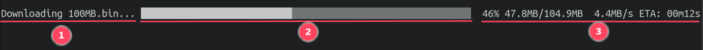
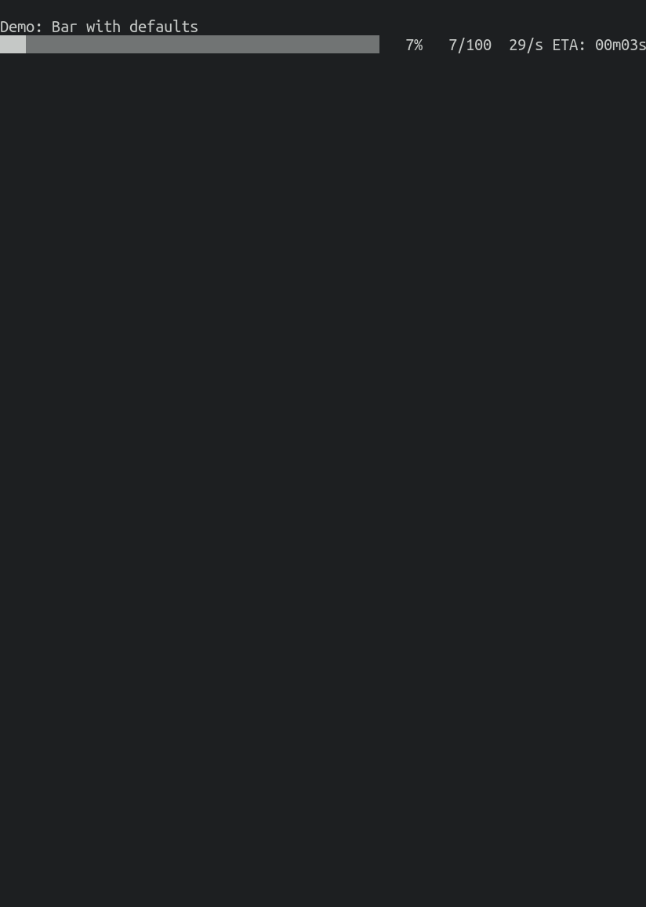

# ⏳ loading

A collection of highly customisable loading bars for Go CLI apps.


## Basic Usage

```go
package main

import (
    "github.com/liamg/loading/pkg/bar"
    "time"
)

func main() {

    // create a bar
    loadingBar := bar.New()

    // set the total to 100
    loadingBar.SetTotal(100)

    // increment the bar to 100 over 10 seconds
    for i := 0; i <= 100; i++ {
        time.Sleep(time.Millisecond * 100)
        loadingBar.SetCurrent(i)
    }
}

```

See the [examples](https://github.com/liamg/loading/tree/main/_examples) or the gallery below for more inspiration.

## Bar Anatomy



1. The label, set with `bar.OptionWithLabel("my label")`.
2. The graphical component, set with `bar.OptionWithRenderFunc(bar.RenderRainbow)`
3. The statistics component, set with `bar.OptionWithStatsFuncs(bar.StatsTimeRemaining)`

## Example Gallery


